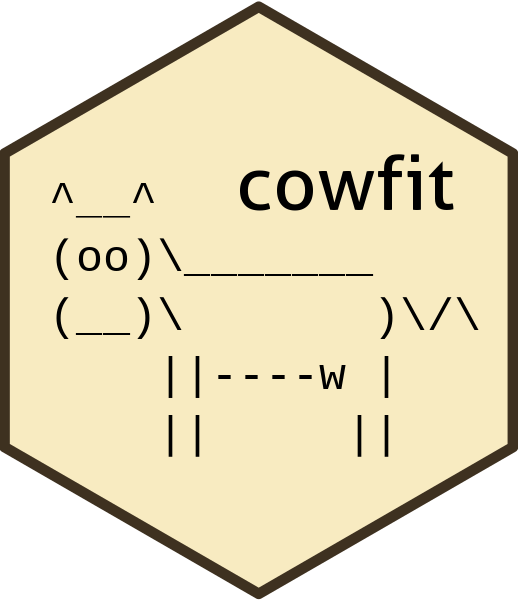

# cowfit: LMMs and GLMMs in genetic evaluation 

This package extends the functionality of the package `pedigreemm` and contains the following improvements

1. Resolves a critical bug in the prediction of random effects
2. Allows for animal models with single observations
3. Allows for random regression models
4. Allows to prespecify the variance components for faster estimation of random effects

## Installation

Install the package `devtools` (with `install.packages("devtools")`) and run the following line of code
```
devtools::install_github("retodomax/cowfit", dependencies=TRUE)
```

## Documentation

* [Getting started with cowfit](https://retodomax.github.io/cowfit/getting_started)
* [Theory]
